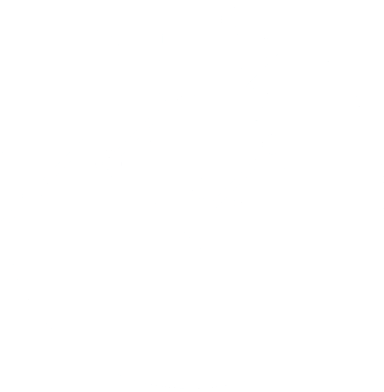
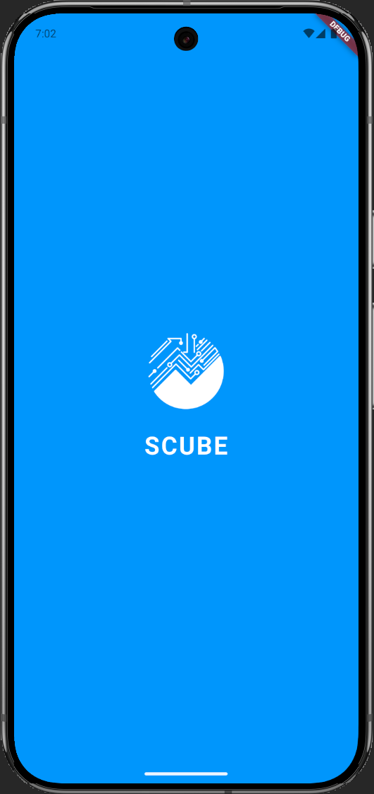
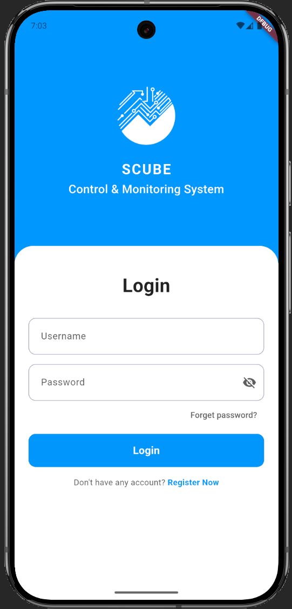
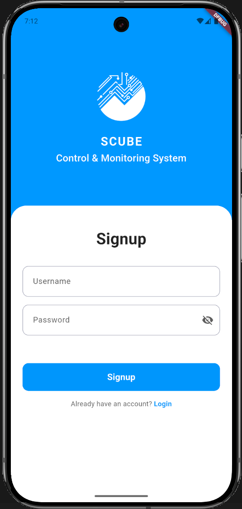
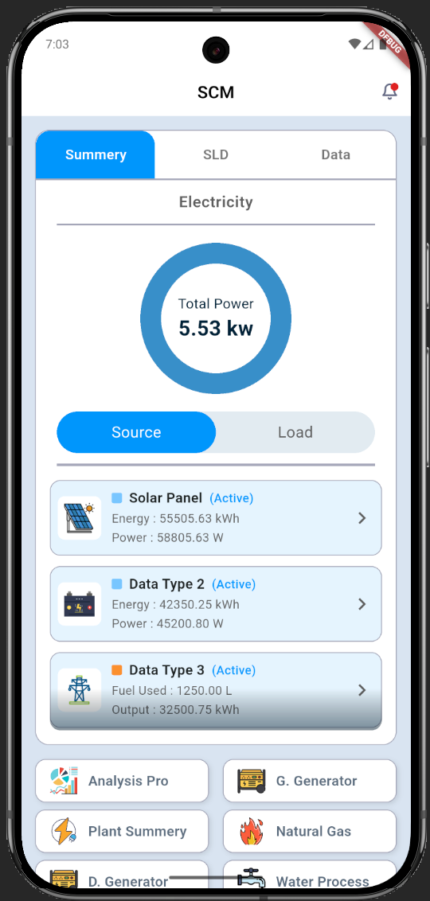
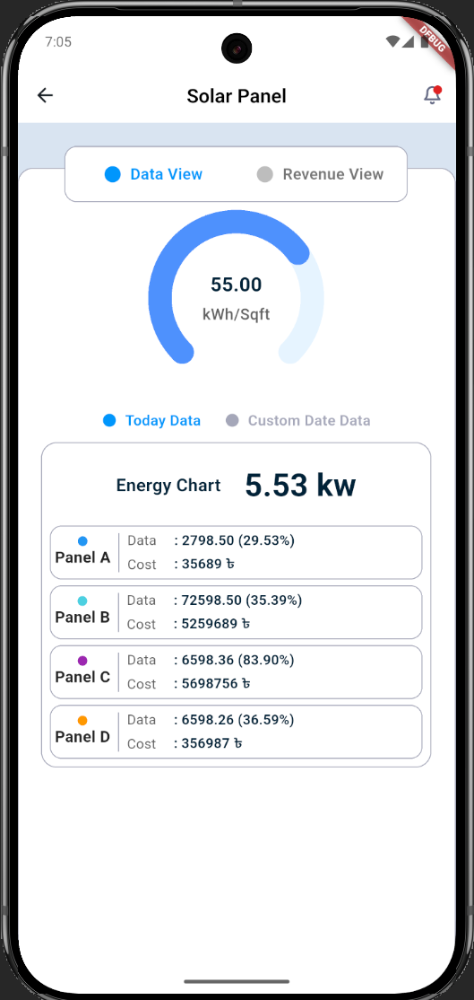
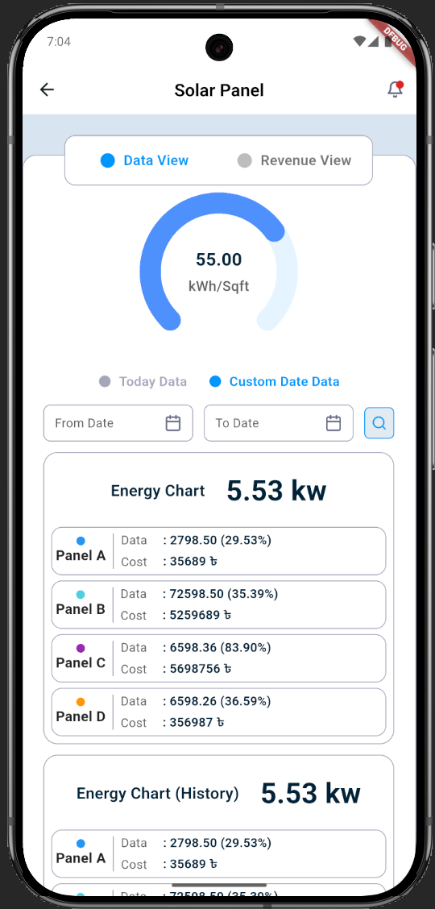
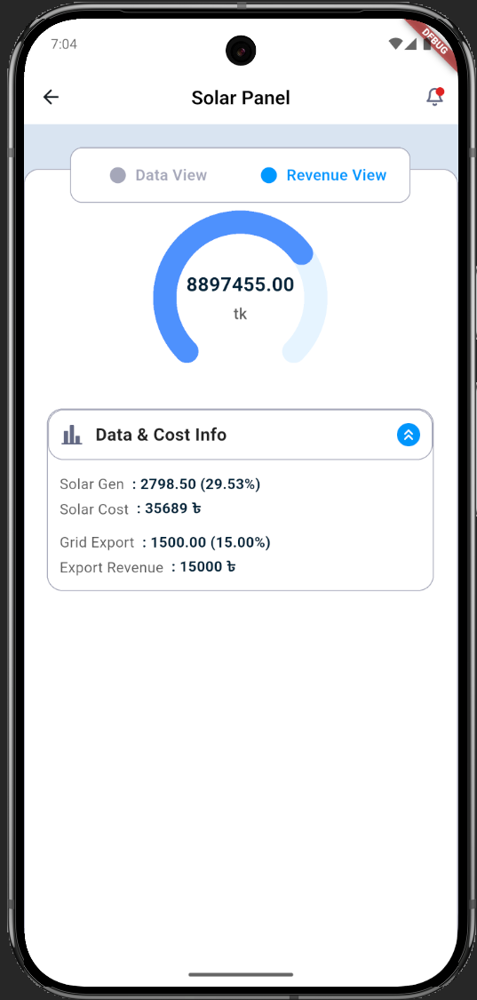
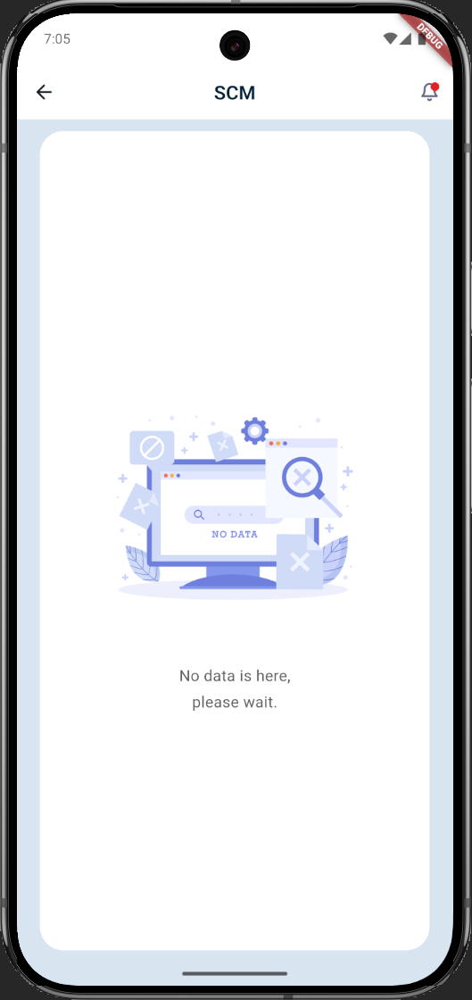

<div align="center">
  
  
  <h1>SCUBE Control & Monitoring System</h1>
  
  <p>
    <strong>A comprehensive Flutter-based mobile application for monitoring and controlling electrical systems, energy consumption, and revenue tracking.</strong>
  </p>

  <p>
    
    
  </p>
</div>

---

## About The Project

**SCUBE** is a modern, intuitive mobile application designed for electrical system monitoring and control. Built with Flutter, it provides real-time data visualization, energy tracking, and comprehensive analytics for industrial and commercial applications.

### Key Features
<table>
  <tr>
    <td valign= "top">
      <h4> Modern UI Design</h4>
      <ul>
        <li>Clean and intuitive interface</li>
        <li>Material Design 3 components</li>
        <li>Smooth animations and transitions</li>
      </ul>
    </td>
    <td valign= "top">
      <h4> Authentication UI</h4>
      <ul>
        <li>Login & signup screen with toggle</li>
        <li>Password visibility control</li>
        <li>Responsive form validation design</li>
      </ul>
    </td>
    <td valign= "top">
      <h4> Interactive Dashboard</h4>
      <ul>
        <li>Multi-tab navigation interface</li>
        <li>Circular progress visualizations</li>
        <li>Color-coded status indicators</li>
      </ul>
    </td>
    
  </tr>
  <tr>
    <td valign= "top">
      <h4> Data Visualization</h4>
      <ul>
        <li>Custom circular charts</li>
        <li>Energy chart displays with breakdown</li>
        <li>Data/Revenue view toggle interface</li>
      </ul>
    </td valign= "top">
     <td>
      <h4> Date Selection UI</h4>
      <ul>
        <li>Today vs custom date toggle</li>
        <li>Date range picker interface</li>
        <li>Smart searching option</li>
      </ul>
    </td>
    <td valign= "top">
      <h4> Modular Components</h4>
      <ul>
        <li>Reusable widget architecture</li>
        <li>Expandable/collapsible panels</li>
        <li>Grid-based menu cards</li>
      </ul>
    </td>
  </tr>

</table>

---

##  Screenshots

<div align="center">
  <table>
    <tr>
      <td align="center">
        
        <br />
        <sub><b>Splash Screen</b></sub>
      </td>
      <td align="center">
        
        <br />
        <sub><b>Login Screen</b></sub>
      </td>
      <td align="center">
        
        <br />
        <sub><b>Signup Screen</b></sub>
      </td>
      <td align="center">
        
        <br />
        <sub><b>Dashboard Screen</b></sub>
      </td>
    </tr>
    <tr>
      <td align="center">
        
        <br />
        <sub><b>Details Screen 1</b></sub>
      </td>
      <td align="center">
        
        <br />
        <sub><b>Details Screen 2</b></sub>
      </td>
      <td align="center">
        
        <br />
        <sub><b>Details Screen 3</b></sub>
      </td>
      <td align="center">
        
        <br />
        <sub><b>Menu Screen</b></sub>
      </td>
    </tr>
  </table>
</div>

---

## 🛠️ Built With

<p>
  
  
  
</p>

### Core Technologies
- **Flutter SDK** - Cross-platform UI framework
- **Dart** - Programming language
- **Material Design 3** - Modern UI components

---

## Getting Started

### Prerequisites

Before running this project, make sure you have the following installed:

```bash
# Check Flutter installation
flutter --version

# Check Dart installation
dart --version
```

Required versions:
- Flutter: `>=3.0.0`
- Dart: `>=3.0.0`

### Installation

1. **Clone the repository**
   ```bash
   git clone https://github.com/yourusername/scube-control-monitoring.git
   cd scube-control-monitoring
   ```

2. **Install dependencies**
   ```bash
   flutter pub get
   ```

3. **Run the app**
   ```bash
   # Run on connected device/emulator
   flutter run

   # Run on specific device
   flutter run -d <device_id>

   # Build APK
   flutter build apk

   # Build iOS
   flutter build ios
   ```

---

## Project Structure

```
lib/
├── core/
│   └── app_colors.dart              # App color constants
│
├── models/
│   ├── cost_data_item.dart          # Cost data model
│   ├── data_source.dart             # Data source model
│   ├── energy_data_item.dart        # Energy data item model
│   └── energy_details.dart          # Energy details model
│
├── screens/
│   ├── dashboard_screen.dart        # Main SCM dashboard
│   ├── data_details_screen.dart     # Data & Revenue view screen
│   ├── login_screen.dart            # Login & Signup screen
│   ├── menu_screen.dart             # Menu/navigation screen
│   └── splash_screen.dart           # Splash screen with logo
│
├── widgets/
│   ├── circular_chart.dart          # Circular chart component
│   ├── circular_progress_widget.dart # Progress indicator
│   ├── data_card.dart               # Data display card
│   ├── data_cost_info_widget.dart   # Cost information panel
│   ├── data_item_card.dart          # Individual data cards
│   ├── date_range_picker_widget.dart # Date picker component
│   ├── date_toggle_widget.dart      # Today/Custom date toggle
│   ├── energy_chart_widget.dart     # Energy chart display
│   ├── menu_card.dart               # Menu item card
│   └── view_toggle_widget.dart      # Data/Revenue toggle
│
├── dummy_data.dart                  # Sample/mock data
└── main.dart                        # App entry point
```

## Design Features

### Color Palette
<table>
  <tr>
    <td align="center" bgcolor="#0098FF" style="color:white; padding:10px;">
      <b>Primary Blue</b><br/>#0098FF
    </td>
    <td align="center" bgcolor="#4A9FDB" style="color:white; padding:10px;">
      <b>Chart Blue</b><br/>#4A9FDB
    </td>
    <td align="center" bgcolor="#E8EEF2" style="padding:10px;">
      <b>Background</b><br/>#E8EEF2
    </td>
    <td align="center" bgcolor="#FFFFFF" style="padding:10px; border:1px solid #ddd;">
      <b>White</b><br/>#FFFFFF
    </td>
  </tr>
</table>

All colors are defined in `lib/core/app_colors.dart` for easy maintenance and consistency.

### UI Components
- **Custom Circular Progress Indicators** - Visual power/revenue display
- **Toggle Switches** - Smooth view transitions
- **Data Cards** - Color-coded information cards
- **Collapsible Panels** - Expandable information sections
- **Date Pickers** - Custom date range selection
- **Interactive Charts** - Real-time data visualization

---

## 🔄 Future Enhancements

- [ ] Backend API integration
- [ ] Real-time data streaming
- [ ] Push notifications for alerts
- [ ] Data export functionality (PDF, Excel)
- [ ] Multi-language support
- [ ] Dark mode theme
- [ ] Historical data graphs
- [ ] User roles and permissions
- [ ] Offline mode with local storage

---

##  Contributing

Contributions are what make the open-source community such an amazing place to learn, inspire, and create. Any contributions you make are **greatly appreciated**.

1. Fork the Project
2. Create your Feature Branch (`git checkout -b feature/AmazingFeature`)
3. Commit your Changes (`git commit -m 'Add some AmazingFeature'`)
4. Push to the Branch (`git push origin feature/AmazingFeature`)
5. Open a Pull Request

### Coding Standards
- Follow [Effective Dart](https://dart.dev/guides/language/effective-dart) guidelines
- Write clear commit messages
- Add comments for complex logic
- Test your changes thoroughly

---

## Bug Reports

If you find a bug, please open an issue with:
- Clear description of the bug
- Steps to reproduce
- Expected vs actual behavior
- Screenshots if applicable
- Device and Flutter version info


---

<div align="center">
  <p>Made with ❤️ using Flutter</p>
  <p>⭐ Star this repository if you find it helpful!</p>
  
  
  
  
</div>
